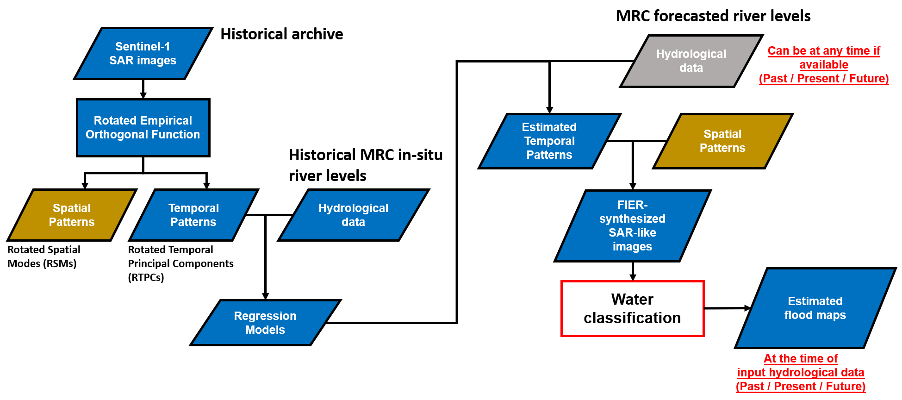

# FIER CLI Usage

The FIER command line application is used for two straightforward commands:
1. `buildregressions` : used to extract spatial/temporal patterns from satellite observations and build regressions to hydrologic variables. The outputs will be saved to a netCDF file for later use. Often times this process needs just to be run every so often.
2. `synthesis` : used to synthesize inundation extent using hydrologic variables and the regressions from step 1. This may be run more regularly depending on how often water extents need to be produced.

Below is workflow showing an implementation using data the Mekong region. Step 1 from above is seen on the left side of the workflow where are the right side represents step 2.


Figure created by [Chi-Hung Chang](https://github.com/chchang1990)

Step 1 can be executed using the following command:

```
./fierapp/bin/fier buildregressions -c config.toml
```

Step 2 can be executed using the following command:

```
./fierapp/bin/fier synthesis -c config.toml
```

The only input into the commands are a configuration file which specifies the data inputs and outputs. The configuration files follow a specific format with sections for the program to parse, detailed information on how to setup the configuration files can be found on the [Configuration docs page](config)
